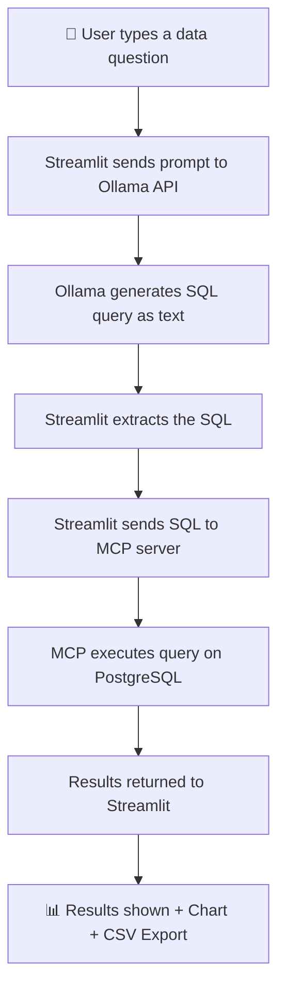

# 🚀 MCP-Powered Streamlit Dashboard with Ollama + PostgreSQL

A modern data analysis tool that lets you:

- Query your PostgreSQL database with natural language
- Run SQL manually or generate it using LLMs (Ollama)
- Analyze data with charts, statistics, and export to CSV

---

## 🧠 Prompt-to-SQL Flow



---

## 📦 Architecture

- **Streamlit** – UI + charting
- **MCP (FastMCP)** – Tools/resources for SQL query and table listing
- **PostgreSQL** – Stores your company data
- **Ollama** – LLM that translates natural language prompts to SQL

---

## 📌 Features

✅ Natural language → SQL  
✅ Charting (bar/line/time series)  
✅ CSV download  
✅ Statistical summary  
✅ Prompt explainability with raw output  
✅ Auto-detect date/time fields  
✅ LLM integration with `llama3` (configurable)

---

## 🛠️ Getting Started

```bash
git clone <this-repo>
cd postgres-mcp-server
docker-compose up --build
```

- Access UI: [http://localhost:8501](http://localhost:8501)
- MCP API: [http://localhost:3333/mcp](http://localhost:3333/mcp)

---

## ⚙️ Env Configuration

```env
MCP_API_URL=http://mcp-server:3333/mcp
OLLAMA_URL=http://ollama:11434/api/generate
```

---

## 📤 Prompt Example

> “List departments with average salary > 50000”

👉 Translated to SQL:
```sql
SELECT department, AVG(salary) FROM employees GROUP BY department HAVING AVG(salary) > 50000;
```

---
Why is this a good use case for MCP?

🔗 MCP makes it dead simple to expose structured tools like SQL queries to LLMs.
🎯 Agents can discover and call your tools without hardcoding logic.
💬 You get the best of both worlds — interpretability, flexibility, and control.

Whether you're building internal tools, research dashboards, or intelligent agents — this pattern is reusable, secure, and 100% local.

## 📄 License

MIT
